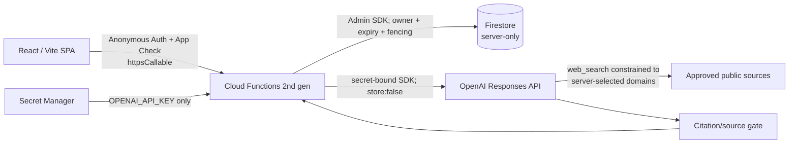

# Know Your Rights

Web-grounded conversational demo for the RMWC worker-rights challenge. It helps a person describe one fictional workplace case in Vietnamese or English, checks new legal/procedural claims against a server-controlled registry of Australian sources, and keeps evidence visible. It is an information prototype, not a lawyer, emergency service or official RMWC service.

**Firebase demo:** <https://know-your-rights-cd8b5.web.app>  
**Project / region:** `know-your-rights-cd8b5` / `australia-southeast1`

## Architecture



- Frontend: React 19, Vite 8, TypeScript 5.9, Tailwind CSS 4 and Firebase Web SDK.
- Backend: callable Firebase Functions 2nd gen on Node.js 22, Firebase Admin SDK, official OpenAI JavaScript SDK and Zod.
- Data: one bounded `conversations/{id}` document per case; grant/quota/runtime metadata is separate. Firestore client Rules deny all reads and writes.
- Hosting: static `dist` with SPA rewrite. There is no Next.js handler, `/api/chat` rewrite, Express server, Storage, Redis or vector database.

The four public contracts are built from `shared/contracts.ts` into the Functions bundle:

- `startConversation({ requestId, accessCode?, replaceConversationId? })`
- `getConversation({ conversationId })`
- `sendMessage({ conversationId, message, userMessageId, attemptId, contextVersion })`
- `clearConversation({ conversationId })`

The browser never supplies an owner UID, system message, full history, domain pool or evidence ledger.

## Conversation engine

Each accepted live turn has two bounded stages outside Firestore transaction callbacks:

1. Planner A uses Structured Outputs without web search. Its snake_case response is allowlisted and validated. Only facts quoted exactly from a user message can be committed.
2. Researcher B runs only for a new legal/procedural claim. The server chooses a relevant subset of the versioned S01–S29 registry, passes only those hosts to `web_search`, and requests native source data. The response is released only if the completed web call, citations, exact HTTPS hosts/paths and source pool all pass the gate. Otherwise the user sees an explicit no-guess fallback.

Both requests use `store: false`, official SDK retries are disabled, and the app resends reduced manual context rather than combining full history with `previous_response_id`. This setting does not promise zero retention by every provider component; the demo disclosure asks users to use fictional data.

## Install and local verification

Use Node `22.16.0` and the committed lockfiles.

```powershell
npm run install:all
npm run check
npm run test:emulator
```

`npm run check` runs typechecks, lint, unit/UI tests, both builds, bundle validation and a secret-pattern scan. Emulator tests use only project `demo-know-your-rights`, remove cloud credential variables and never call OpenAI.

For a labelled UI-only mock, copy `.env.example` to an ignored local environment file and keep `VITE_CHAT_MODE=mock`. For emulator development use `VITE_CHAT_MODE=emulator`. Localhost/emulators are development tools, not the cloud acceptance test.

## Firebase configuration

Only public Firebase Web identifiers and the public reCAPTCHA Enterprise site key use `VITE_*`; start from `.env.example`. They identify the app but do not authorize data access.

Set secret values interactively with the official CLI—never put them in the repository or chat:

```powershell
node node_modules/firebase-tools/lib/bin/firebase.js functions:secrets:set OPENAI_API_KEY --project know-your-rights-cd8b5
node node_modules/firebase-tools/lib/bin/firebase.js functions:secrets:set DEMO_ACCESS_CODE --project know-your-rights-cd8b5
```

`OPENAI_API_KEY` is bound only to `sendMessage`; `DEMO_ACCESS_CODE` is bound only to `startConversation`. Changing a secret requires redeploying the function that consumes it. The runtime identity uses Google-managed credentials; do not create a public service-account JSON.

Required console configuration:

- enable Anonymous Authentication;
- register the Firebase Web App with App Check using reCAPTCHA Enterprise and include both Firebase Hosting domains;
- keep callable `enforceAppCheck: true` outside emulators;
- keep `runtime/demo.enabled` operator-controlled and `syntheticOnly: true` with UID/global limits;
- enable Firestore TTL on `expiresAt` for `conversations`, `demoGrants` and `usageBuckets` (TTL is asynchronous cleanup, never an authorization check).

## Deploy and stop the demo

Build does not require either secret. Deploy manually and always name the project:

```powershell
npm run check
node node_modules/firebase-tools/lib/bin/firebase.js deploy --project know-your-rights-cd8b5
```

There is deliberately no GitHub auto-deploy. To stop new sessions and AI work, set `runtime/demo.enabled` to `false` through an authenticated operator path, then verify `startConversation`/`sendMessage` fail while `/help` and owner `clearConversation` still work. Budget alerts are alerts only; `maxInstances` is not a hard spending cap, and Firebase limits do not cap OpenAI spend.

## Privacy and limits

- Firebase Auth establishes an anonymous UID; anonymous does not mean that no identifier exists.
- App-owned `sessionStorage` contains only an opaque conversation pointer and suppression flag, never transcript/facts/evidence.
- Conversation access expires 30 minutes after accepted user activity. Polling does not extend it. TTL deletion can happen later.
- Grant, start-dedupe and usage metadata remains for 24 hours and contains no raw access code or story. Clear does not reset quota or delete the Anonymous Auth account.
- A session is limited to 40 total messages, 4,000 characters per user message and a conservative document budget below 512 KiB.
- Non-streaming answers appear only after the source gate. There is no fake progress or fake live answer.

## Documentation

- `docs/blueprint.md` — v4 product and technical specification
- `docs/deployment.md` — environment, deployment and operator checklist
- `docs/demo-script.md` — short synthetic judging flow
- `docs/evaluation.md` — T01–T34 and F01–F16 evidence ledger
- `docs/source-policy.md` — S01–S29 registry and routing/gating rules
- `docs/milestone-3.md` — authenticated session and retention implementation record
- `docs/milestone-4-8.md` — integrated build/deploy evidence and remaining limits

This is a bounded hackathon demo. It is not production-ready. The post-event path is to separate staging/production, obtain legal/content review, add observability without story logs, run accessibility/security testing, establish deletion and incident procedures, and measure grounded-claim quality before serving real cases.

Official implementation references: [Firebase callable Functions](https://firebase.google.com/docs/functions/callable), [Firebase App Check for web](https://firebase.google.com/docs/app-check/web/recaptcha-provider), [Firebase Hosting configuration](https://firebase.google.com/docs/hosting/full-config), [OpenAI Responses API](https://developers.openai.com/api/reference/cli/resources/responses/methods/create), and [GPT-5.4 mini model capabilities](https://developers.openai.com/api/docs/models/gpt-5.4-mini).
