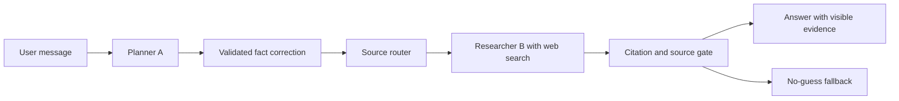
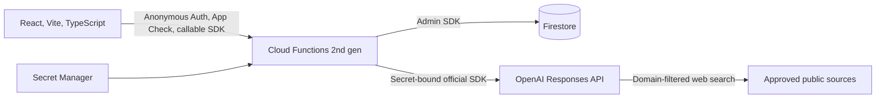

# Know Your Rights

### A safer first step for migrant workers facing workplace problems

**RMWC challenge submission**  
Team: **[Add team name and members]**

<https://know-your-rights-cd8b5.web.app>

<small>Hackathon prototype. Not legal advice, an emergency service, or an official RMWC service.</small>

---

# The access gap

A migrant worker notices missing overtime on a payslip.

The answer may exist, but it is spread across government pages, state regulators, community legal services, and unfamiliar legal language.

The worker may also worry about visa consequences, employer retaliation, or sharing too much personal information.

## The real problem

The first question is rarely phrased like a legal search query. People need a safe conversation that helps them understand the issue before they decide what to do next.

---

# The product

## A bilingual, web-grounded worker rights chat

**Natural conversation**  
Users describe one workplace situation in Vietnamese or English. No mandatory intake form asks for a name, email, address, or visa number.

**Current information with evidence**  
New legal or procedural claims require a fresh search within a server-approved source pool. Accepted sources stay visible beside the chat.

**User-controlled next steps**  
Users can correct facts by chat, edit and copy a case summary, open support services, clear the conversation, or use Quick Exit.

---

# User journey

1. **Read the disclosure**  
   The user learns that fictional demo data may reach Firebase and an external AI service.

2. **Describe the situation**  
   The chat accepts ordinary language and asks only for information needed for the current issue.

3. **Check the answer**  
   The user opens the source drawer and sees the exact evidence accepted for that response.

4. **Choose the next action**  
   The user can continue, correct a fact, copy a summary, visit Help, clear the chat, or leave quickly.

> “I work in Sydney and this week’s payslip is missing my overtime hours. What should I check first?”

---

# Grounded response pipeline

**Planner A** uses Structured Outputs and no web access. It classifies the turn, rewrites a standalone question, and proposes fact or state changes.

**Researcher B** runs only when new evidence is needed. It receives reduced context and domains selected by the server.

**The gate** checks response completion, a real web call, native citations, exact HTTPS hosts and permitted paths. A failed gate releases no unsupported answer.

---

# Source policy

The versioned registry contains **29 Australian sources** across employment, pay, safety, compensation, discrimination, visa, housing, privacy, language support, and urgent help.

Examples include:

- Fair Work Ombudsman and Fair Work Commission
- State workplace safety regulators
- Department of Home Affairs and the Australian Human Rights Commission
- RMWC, Legal Aid NSW, community legal centres, and migrant worker services

The router searches only a relevant subset for the current topic and jurisdiction. A NSW to Victoria correction changes the state source pool before new research.

ATO remains conditional because its pages require additional review. Emergency and anti-slavery support links stay link-only and never become broad search domains.

---

# Firebase architecture

- Firebase Hosting serves the SPA and supports direct refresh on Home, Chat, Help, and Safe routes.
- Firestore remains server-only. Client Rules deny all reads and writes.
- Four callable Functions control session start, restore, message processing, and deletion.
- The browser never sends an owner UID, system prompt, full transcript, domain list, or evidence ledger.

---

# Trust and safety boundaries

**Identity and access**  
Firebase Auth identifies an anonymous session. A separate demo grant, App Check, owner checks, expiry, and quotas control access.

**Short cloud retention**  
Conversation access expires after 30 minutes of accepted user activity. Firestore TTL cleans up later, so the product never calls expiry an immediate deletion.

**Bounded data**  
The demo allows one case per conversation, no more than 40 total messages, a 4,000-character user input, and a document budget below 512 KiB.

**Safe exit**  
Quick Exit covers the interface immediately, moves to a neutral page, requests server deletion while Auth is valid, and reports failure honestly.

---

# What the demo proves

## A complete cloud vertical slice within the hackathon window

- Real Firebase Hosting URL, not a localhost presentation
- Anonymous Auth and App Check on regional callable Functions
- Server-owned Firestore conversation state with ownership, expiry, quotas, leases, and fencing
- Structured planning, jurisdiction-aware source routing, native citation validation, and a no-guess fallback
- Responsive VI/EN interface with transcript, Sources, Facts, editable Summary, Help, Clear, and Quick Exit

Local checks use fake providers and Firebase emulators. The live acceptance check uses a fictional prompt and a tightly bounded OpenAI request budget.

---

# Why this approach matters

Generic chat can sound confident before it has reliable evidence.

Know Your Rights treats evidence as a release condition for new legal claims. The user can see what the answer relied on and can correct the facts that drive jurisdiction and routing.

For community organisations, the same design offers a clearer handoff. A user-controlled summary can help someone prepare for a support conversation without automatically sending their story to another service.

## Product principle

**Useful enough to help someone take a first step, cautious enough to stop when evidence is weak.**

---

# Path beyond the hackathon

**Next two weeks**  
Separate staging from production, close P0 defects, review logs and quotas, test rollback, and complete mobile, accessibility, cross-browser, and multi-instance QA.

**Next two months**  
Add formal content ownership, page-level source review, evaluation sets created with worker-rights experts, translated content review, incident response, and stale anonymous account cleanup.

**Before serving real cases**  
Complete privacy and legal review, threat modelling, abuse testing, retention verification, support-service governance, and claim-level quality measurement with human reviewers.

Success means that important claims have supporting evidence, users understand the limits, and failed research ends in a safe next step.

---

# A safer place to begin

Know Your Rights helps a worker turn an uncertain workplace problem into:

**a clearer question, evidence they can inspect, and a next step they control.**

### Demo

<https://know-your-rights-cd8b5.web.app>

**Questions?**

---

# Appendix: judging checks

- A greeting or request to simplify should not trigger unnecessary web research.
- A new rule, amount, deadline, or legal claim should trigger fresh research.
- A user fact must include an exact quote and source user-message ID.
- A false host such as `fairwork.gov.au.evil.example` must fail the gate.
- A late result after Clear or Quick Exit must not recreate or display the conversation.
- Two anonymous UIDs must never read or alter each other’s conversation.
- Static Help must remain usable when AI is disabled.

Full status ledger: `docs/evaluation.md`

---

# Appendix: approved source examples

| Area | Example sources |
|---|---|
| Employment and pay | Fair Work Ombudsman, Fair Work Commission, Federal Register of Legislation |
| Visa and migrant support | Department of Home Affairs, RMWC, IARC, Migrant Workers Centre |
| Workplace safety | Safe Work Australia and the regulator for each state or territory |
| Discrimination and privacy | Australian Human Rights Commission, Anti-Discrimination NSW, OAIC |
| Legal and practical support | Legal Aid NSW, Redfern Legal Centre, Tenants' Union of NSW, TIS National |

